<!-- ========================== HERO ========================== -->
<div align="center" style="background-color:#0d1117; padding:20px; border-radius:10px;">



<h1 style="color:#58a6ff; margin-bottom:5px;">👋 Hi, I'm Habibur Rahman</h1>
<h3 style="color:#c9d1d9; margin-top:0;">Backend-Focused • Type-Safe • System-Driven</h3>

<p style="margin:10px 0;">
  <a href="https://www.linkedin.com/in/habibur-rahman44/">
    
  </a>
  <a href="https://habibur-rahman-snowy.vercel.app/">
    
  </a>
  <a href="mailto:habib.rahman0330@gmail.com">
    
  </a>
  <a href="https://twitter.com/_habib7">
    
  </a>
</p>

<p>
  
</p>

</div>

---

## 💼 About Me
<div align="center" style="background-color:#161b22; padding:15px 20px; border-radius:10px; color:#c9d1d9; margin-bottom:15px; border:1px solid #30363d; line-height:1.6;">
I craft <b>production-ready full-stack applications</b> with a <b>backend-heavy focus</b>.<br/>
Focus: <b style="color:#58a6ff;">Type-Safety</b> • <b style="color:#8b5cf6;">Scalable Systems</b> • <b style="color:#f97316;">Clean Architecture</b>
</div>

<p align="center" style="color:#8b949e; margin-bottom:15px;">
🎯 Predictable systems | 📋 Explicit contracts | 🛡️ Type safety
</p>

---

## 🎯 Engineering Focus
<div align="center" style="display:flex; justify-content:center; gap:15px; flex-wrap:wrap; margin-bottom:20px;">

<!-- What I Build -->
<div style="background-color:#161b22; border-radius:10px; border:1px solid #30363d; min-width:260px; color:#c9d1d9;">
  <div style="background-color:#0d1117; padding:12px 15px; border-bottom:1px solid #30363d; display:flex; align-items:center;">
    <span style="color:#58a6ff; font-weight:bold; font-family:monospace; margin-right:8px;">▸</span>
    <span style="font-weight:bold; color:#58a6ff; font-family:monospace; font-size:1.1em;">🏗️ What I Build</span>
  </div>
  <ul style="padding:15px; margin:0; list-style-type:disc; line-height:1.6;">
    <li>Modular backend services & APIs</li>
    <li>Secure authentication flows</li>
    <li>Scalable, data-driven apps</li>
    <li>Maintainable full-stack solutions</li>
  </ul>
</div>

<!-- How I Think -->
<div style="background-color:#161b22; border-radius:10px; border:1px solid #30363d; min-width:260px; color:#c9d1d9;">
  <div style="background-color:#0d1117; padding:12px 15px; border-bottom:1px solid #30363d; display:flex; align-items:center;">
    <span style="color:#8b5cf6; font-weight:bold; font-family:monospace; margin-right:8px;">▸</span>
    <span style="font-weight:bold; color:#8b5cf6; font-family:monospace; font-size:1.1em;">🧠 How I Think</span>
  </div>
  <ul style="padding:15px; margin:0; list-style-type:disc; line-height:1.6;">
    <li>Clean architecture over tight coupling</li>
    <li>Schema-first data modeling</li>
    <li>Performance-aware decision-making</li>
    <li>Pragmatic engineering trade-offs</li>
  </ul>
</div>

</div>

---

## 🛠️ Tech Stack
<div align="center" style="display:flex; justify-content:center; gap:15px; flex-wrap:wrap; margin-bottom:20px;">

<!-- Backend -->
<div style="background-color:#161b22; border-radius:10px; border:1px solid #30363d; min-width:260px; color:#c9d1d9;">
  <div style="background-color:#0d1117; padding:12px 15px; border-bottom:1px solid #30363d; display:flex; align-items:center;">
    <span style="color:#58a6ff; font-weight:bold; font-family:monospace; margin-right:8px;">▸</span>
    <span style="font-weight:bold; color:#58a6ff; font-family:monospace; font-size:1.1em;">🔧 Backend & APIs</span>
  </div>
  <p align="center" style="margin:15px 0;">
    
  </p>
  <p style="padding:0 15px; color:#8b949e; margin-bottom:15px; line-height:1.6;" align="center">
    REST API | JWT auth | Modular services | Redis caching | Database optimization
  </p>
</div>

<!-- Frontend -->
<div style="background-color:#161b22; border-radius:10px; border:1px solid #30363d; min-width:260px; color:#c9d1d9;">
  <div style="background-color:#0d1117; padding:12px 15px; border-bottom:1px solid #30363d; display:flex; align-items:center;">
    <span style="color:#8b5cf6; font-weight:bold; font-family:monospace; margin-right:8px;">▸</span>
    <span style="font-weight:bold; color:#8b5cf6; font-family:monospace; font-size:1.1em;">🎨 Frontend</span>
  </div>
  <p align="center" style="margin:15px 0;">
    
  </p>
  <p style="padding:0 15px; color:#8b949e; margin-bottom:15px; line-height:1.6;" align="center">
    Component-driven UI | Typed client-server | Performance-aware rendering | Shadcn UI
  </p>
</div>

<!-- DevOps -->
<div style="background-color:#161b22; border-radius:10px; border:1px solid #30363d; min-width:260px; color:#c9d1d9;">
  <div style="background-color:#0d1117; padding:12px 15px; border-bottom:1px solid #30363d; display:flex; align-items:center;">
    <span style="color:#f97316; font-weight:bold; font-family:monospace; margin-right:8px;">▸</span>
    <span style="font-weight:bold; color:#f97316; font-family:monospace; font-size:1.1em;">🐳 DevOps</span>
  </div>
  <p align="center" style="margin:15px 0;">
    
  </p>
  <p style="padding:0 15px; color:#8b949e; margin-bottom:15px; line-height:1.6;" align="center">
    Docker | Clean repo & commits | Automated quality checks
  </p>
</div>

</div>

---

## 🚀 Featured Project

### 📌 Trip Buddy
*A full-stack travel planning application*

<div style="background-color:#161b22; border-radius:10px; border:1px solid #30363d; min-width:260px; color:#c9d1d9; margin-bottom:12px;">
  <div style="background-color:#0d1117; padding:12px 15px; border-bottom:1px solid #30363d; display:flex; align-items:center;">
    <span style="color:#58a6ff; font-weight:bold; font-family:monospace; margin-right:8px;">▸</span>
    <span style="font-weight:bold; color:#58a6ff; font-family:monospace; font-size:1.1em;">✨ Key Features</span>
  </div>
  <ul style="padding:15px; margin:0; list-style-type:disc; line-height:1.6;">
    <li>Full-stack architecture: Express.js backend + React frontend</li>
    <li>Shadcn UI components for modern, responsive frontend</li>
    <li>JWT-based authentication & role-based access control</li>
    <li>Optimized queries with pagination for fast data retrieval</li>
    <li>Redis caching for performance-critical operations</li>
    <li>Type-safe API communication between frontend and backend</li>
    <li>Built as a Turborepo monorepo for modularity</li>
  </ul>
</div>

<div align="center" style="margin-bottom:20px;">
  <a href="https://github.com/habib33-3/trip-buddy">
    
  </a>
  <a href="https://habibur-rahman-snowy.vercel.app/">
    
  </a>
</div>

---

## 📊 GitHub Stats
<div align="center" style="display:flex; justify-content:center; gap:15px; flex-wrap:wrap; margin-bottom:20px;">
  
  
</div>

<div align="center" style="margin-bottom:20px;">
  
</div>

<div align="center" style="margin-bottom:20px;">
  
</div>

---

## 🏆 Achievements
<div align="center" style="margin-bottom:20px;">
  
</div>

---

## 🎓 Current Direction

```typescript
const currentFocus = {
  learning: [
    "🎯 Advanced system design patterns",
    "🐳 Docker & container orchestration",
    "⚡ Database optimization techniques",
    "🏗️ Microservices architecture"
  ],
  building: "💻 Backend-heavy full-stack applications",
  exploring: "🔗 Type-safe API design patterns",
  goal: "🚀 Scalable, maintainable production systems"
};
````

---

## 📬 Let's Connect

Open to **backend-focused full-stack roles** where ***system design***, ***data modeling***, and ***clean architecture*** are priorities.

**Available for:**

* 💼 Full-time positions
* 🤝 Contract work
* 💡 Technical collaboration

<div align="center" style="margin-bottom:20px;">
  <a href="https://www.linkedin.com/in/habibur-rahman44/">
    
  </a>
  <a href="https://habibur-rahman-snowy.vercel.app/">
    
  </a>
  <a href="mailto:habib.rahman0330@gmail.com">
    
  </a>
</div>

---

## 💭 Dev Wisdom

<div align="center" style="background-color:#0d1117; padding:12px 15px; border-radius:10px; color:#58a6ff; border:1px solid #30363d; line-height:1.6;">

</div>

